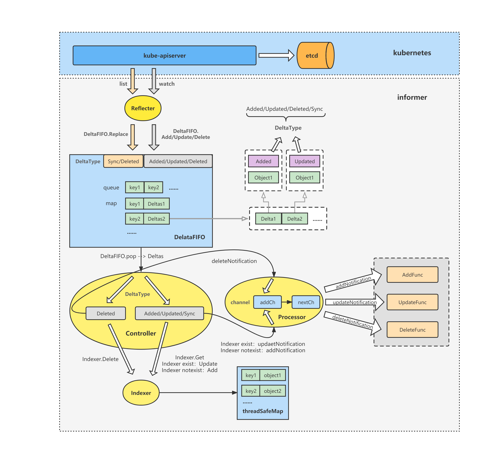

# Processor

Processor根据Controller的通知，即根据对象的变化事件类型，调用相应的ResourceEventHandler来处理对象的变化

### processor核心处理方法分析 <a href="#id-4processor-he-xin-chu-li-fang-fa-fen-xi" id="id-4processor-he-xin-chu-li-fang-fa-fen-xi"></a>

可以看到distribute方法最终是将构造好的addNotification、updateNotification、deleteNotification对象写入到p.addCh中

```go
// staging/src/k8s.io/client-go/tools/cache/shared_informer.go
func (p *sharedProcessor) distribute(obj interface{}, sync bool) {
	p.listenersLock.RLock()
	defer p.listenersLock.RUnlock()

	if sync {
		for _, listener := range p.syncingListeners {
			listener.add(obj)
		}
	} else {
		for _, listener := range p.listeners {
			listener.add(obj)
		}
	}
}

func (p *processorListener) add(notification interface{}) {
	p.addCh <- notification
}

```

**sharedIndexInformer.processor.run**

s.processor.run启动了processor，其中注意到listener.run与listener.pop两个核心方法。

这里可以看到processor的run方法中只启动了p.listeners，没有启动p.syncingListeners

```go
// staging/src/k8s.io/client-go/tools/cache/shared_informer.go
func (p *sharedProcessor) run(stopCh <-chan struct{}) {
	func() {
		p.listenersLock.RLock()
		defer p.listenersLock.RUnlock()
		for _, listener := range p.listeners {
			p.wg.Start(listener.run)
			p.wg.Start(listener.pop)
		}
		p.listenersStarted = true
	}()
	<-stopCh
	p.listenersLock.RLock()
	defer p.listenersLock.RUnlock()
	for _, listener := range p.listeners {
		close(listener.addCh) // Tell .pop() to stop. .pop() will tell .run() to stop
	}
	p.wg.Wait() // Wait for all .pop() and .run() to stop
}

```

**processorListener.pop**

分析processorListener的pop方法可以得知，其逻辑实际上就是将p.addCh中的对象给拿出来，然后丢进了p.nextCh中

```go
// staging/src/k8s.io/client-go/tools/cache/shared_informer.go
func (p *processorListener) pop() {
	defer utilruntime.HandleCrash()
	defer close(p.nextCh) // Tell .run() to stop

	var nextCh chan<- interface{}
	var notification interface{}
	for {
		select {
		case nextCh <- notification:
			// Notification dispatched
			var ok bool
			notification, ok = p.pendingNotifications.ReadOne()
			if !ok { // Nothing to pop
				nextCh = nil // Disable this select case
			}
		case notificationToAdd, ok := <-p.addCh:
			if !ok {
				return
			}
			if notification == nil { // No notification to pop (and pendingNotifications is empty)
				// Optimize the case - skip adding to pendingNotifications
				notification = notificationToAdd
				nextCh = p.nextCh
			} else { // There is already a notification waiting to be dispatched
				p.pendingNotifications.WriteOne(notificationToAdd)
			}
		}
	}
}

```

**processorListener.run**

在processorListener的run方法中，将循环读取p.nextCh，判断对象类型，是updateNotification则调用p.handler.OnUpdate方法，是addNotification则调用p.handler.OnAdd方法，是deleteNotification则调用p.handler.OnDelete方法做处理

```go
// staging/src/k8s.io/client-go/tools/cache/shared_informer.go
func (p *processorListener) run() {
	// this call blocks until the channel is closed.  When a panic happens during the notification
	// we will catch it, **the offending item will be skipped!**, and after a short delay (one second)
	// the next notification will be attempted.  This is usually better than the alternative of never
	// delivering again.
	stopCh := make(chan struct{})
	wait.Until(func() {
		// this gives us a few quick retries before a long pause and then a few more quick retries
		err := wait.ExponentialBackoff(retry.DefaultRetry, func() (bool, error) {
			for next := range p.nextCh {
				switch notification := next.(type) {
				case updateNotification:
					p.handler.OnUpdate(notification.oldObj, notification.newObj)
				case addNotification:
					p.handler.OnAdd(notification.newObj)
				case deleteNotification:
					p.handler.OnDelete(notification.oldObj)
				default:
					utilruntime.HandleError(fmt.Errorf("unrecognized notification: %T", next))
				}
			}
			// the only way to get here is if the p.nextCh is empty and closed
			return true, nil
		})

		// the only way to get here is if the p.nextCh is empty and closed
		if err == nil {
			close(stopCh)
		}
	}, 1*time.Minute, stopCh)
}


```

而p.handler.OnUpdate、p.handler.OnAdd、p.handler.OnDelete方法实际上就是自定义的的ResourceEventHandlerFuncs了

```go
informer.AddEventHandler(cache.ResourceEventHandlerFuncs{
    AddFunc:    onAdd,
    UpdateFunc: onUpdate,
    DeleteFunc: onDelete,
  })

```

```go
// staging/src/k8s.io/client-go/tools/cache/controller.go
type ResourceEventHandlerFuncs struct {
	AddFunc    func(obj interface{})
	UpdateFunc func(oldObj, newObj interface{})
	DeleteFunc func(obj interface{})
}

func (r ResourceEventHandlerFuncs) OnAdd(obj interface{}) {
	if r.AddFunc != nil {
		r.AddFunc(obj)
	}
}

func (r ResourceEventHandlerFuncs) OnUpdate(oldObj, newObj interface{}) {
	if r.UpdateFunc != nil {
		r.UpdateFunc(oldObj, newObj)
	}
}

func (r ResourceEventHandlerFuncs) OnDelete(obj interface{}) {
	if r.DeleteFunc != nil {
		r.DeleteFunc(obj)
	}
}

```

<figure><figcaption></figcaption></figure>


